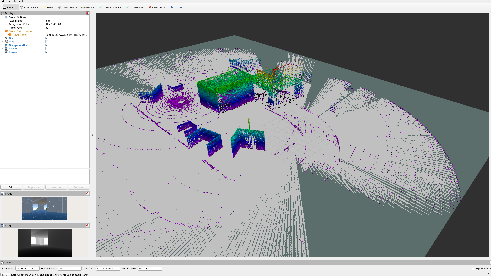

# General

This Repository is part of a project for the course "Digitale Fabrik".
It is just a Unity-ROS-TCP Endpoint which uses Octomap and different topics to show it in RViz.

Background: I simulate an 3D-LiDAR and a RGBD-Camera in Unity and send the data to ROS through ROS Topics.

>[!CAUTION]
> The Unity Project is not part of the repo!]

I have used ROS2 Humble but I guess any **ROS2** version should work.

# Dependencies

As if I use octomap to get a better visualization of topics we get from unity, we need to install the octomap-server package.

 ```bash
  sudo apt-get install ros-<ros_distro>-octomap-server

 ```

# Build 

Build the package in the source Directory and source it with: 


 ```bash
colcon build --symlink-install
source install/setup.bash
 ```

# Run

Run the package with:


 ```bash
ros2 launch ros_tcp_endpoint custom.py
 ```

Rviz2 should open and you should see the cotomap and the topics from Unity.



# Credits

Untiy-ROS-TCP-Endpoint is from (Unity-Technologies){https://github.com/Unity-Technologies/ROS-TCP-Endpoint}
